# Identity Resolution Logic Flowchart

This Mermaid diagram represents the complete identity resolution logic flow, including all three possible actions: Create New Profile, Add to Existing Profile, and Merge Existing Profiles.

```mermaid
flowchart TD
    Start([Event Payload with Identifiers]) --> Q1{Does this event payload contain<br/>an identifier that already exists<br/>on another profile?}
    
    %% No existing profile path
    Q1 -->|No| CreateNew[🆕 Action: Create New Profile]
    
    %% Yes, existing profile(s) found
    Q1 -->|Yes, 1 or more| Q2{Would adding any of the payload's<br/>identifiers to existing profile<br/>conflict with identity resolution limits?}
    
    %% No conflicts - direct add
    Q2 -->|No| Q3{Are there other identifiers<br/>in the payload that belong<br/>to more than one profile?}
    
    Q3 -->|No, only one profile| AddExisting[➕ Action: Add to Existing Profile]
    Q3 -->|No, no profiles exist<br/>with the listed identifiers| CreateNew2[🆕 Action: Create New Profile]
    
    %% Multiple profiles - check merge possibility
    Q3 -->|Yes| Q4{Would merging these existing<br/>profiles across these shared<br/>identifiers conflict or exceed<br/>the identity resolution limits?}
    
    Q4 -->|No| MergeProfiles[🔀 Action: Merge Existing Profiles]
    
    %% Merge conflicts - drop and retry
    Q4 -->|Yes| DropForMerge[🗑️ Drop identifier with<br/>lowest priority from payload]
    DropForMerge --> Q1
    
    %% Conflicts exist - start dropping identifiers
    Q2 -->|Yes| Drop1[🗑️ Drop identifier with<br/>lowest priority from payload]
    
    Drop1 --> Q5{After dropping lowest priority,<br/>would adding any of the remaining<br/>identifiers in the payload still<br/>conflict with identity resolution<br/>limits for the existing profile?}
    
    %% After first drop - no more conflicts, loop back to main logic
    Q5 -->|No| Q2
    
    %% After first drop - still conflicts, continue dropping
    Q5 -->|Yes| Drop2[🗑️ Drop identifier with<br/>lowest priority from payload]
    Drop2 --> Q5
    
    %% Style the action nodes
    classDef createAction fill:#e1f5fe,stroke:#01579b,stroke-width:2px,color:#000
    classDef addAction fill:#f3e5f5,stroke:#4a148c,stroke-width:2px,color:#000
    classDef mergeAction fill:#e8f5e8,stroke:#1b5e20,stroke-width:2px,color:#000
    classDef dropAction fill:#fff3e0,stroke:#e65100,stroke-width:2px,color:#000
    
    class CreateNew,CreateNew2 createAction
    class AddExisting addAction
    class MergeProfiles mergeAction
    class Drop1,Drop2,DropForMerge dropAction
```

## Key Components:

### Decision Points:
1. **Initial Profile Check**: Does the event contain identifiers that exist on other profiles?
2. **Conflict Check**: Would adding identifiers exceed limits/frequency rules?
3. **Multi-Profile Check**: Are there identifiers spanning multiple profiles?
4. **Merge Feasibility**: Can profiles be merged without exceeding limits?
5. **Post-Drop Conflict Check**: After dropping identifiers, are there still conflicts?

### Actions:
- 🆕 **Create New Profile**: When no matching identifiers exist or after conflict resolution
- ➕ **Add to Existing Profile**: When identifiers can be safely added to one profile
- 🔀 **Merge Existing Profiles**: When multiple profiles can be combined within limits
- 🗑️ **Drop Identifier**: Remove lowest priority identifier to resolve conflicts

### Logic Flow:
- The system continuously drops the lowest priority identifiers when conflicts occur
- After each drop, it re-evaluates the entire decision tree
- The process continues until a valid action can be taken
- Priority order is determined by the Identity Resolution Configuration settings

### Identity Resolution Configuration Impact:
- **Priority**: Determines which identifiers to drop first
- **Limit**: Maximum number of unique values per identifier type
- **Frequency**: Time-based constraints (Daily, Weekly, Monthly, Ever)
